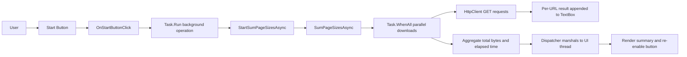
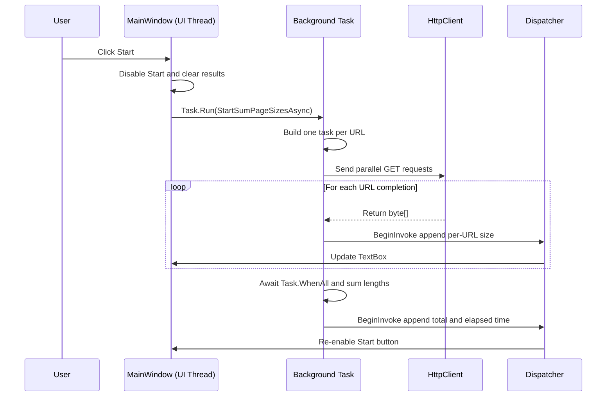

# APL2007M2Sample1

這是一個 .NET 6 WPF 桌面範例專案，示範在 Windows 上進行平行非同步 HTTP 下載，以及如何將背景執行結果切回 UI 執行緒更新畫面。

## 目錄

- [APL2007M2Sample1](#apl2007m2sample1)
  - [目錄](#目錄)
  - [專案概觀](#專案概觀)
  - [專案目的](#專案目的)
  - [技術棧](#技術棧)
  - [系統架構](#系統架構)
  - [執行流程](#執行流程)
  - [功能清單](#功能清單)
  - [專案結構](#專案結構)
  - [運作方式（程式碼導覽）](#運作方式程式碼導覽)
    - [1) 應用程式啟動](#1-應用程式啟動)
    - [2) UI 版面](#2-ui-版面)
    - [3) 點擊 Start 後的行為](#3-點擊-start-後的行為)
    - [4) 平行處理](#4-平行處理)
    - [5) 單一 URL 的處理](#5-單一-url-的處理)
    - [6) UI 執行緒切換](#6-ui-執行緒切換)
  - [前置需求](#前置需求)
  - [安裝與執行](#安裝與執行)
  - [預期輸出](#預期輸出)
  - [設定方式](#設定方式)
  - [已知風險與限制](#已知風險與限制)
  - [疑難排解](#疑難排解)
  - [測試](#測試)
  - [後續改進建議](#後續改進建議)
  - [貢獻方式](#貢獻方式)
  - [授權](#授權)

## 專案概觀

本專案是以 .NET 6 + WPF 建立的 GUI 桌面範例程式。
使用者按下 Start 按鈕後，程式會對多個 Microsoft Docs 網址同時送出 HTTP 請求，逐筆顯示回應大小，最後統計總位元組數與總耗時。

程式碼規模小、偏教學用途，主要邏輯集中在單一檔案中。

## 專案目的

此專案的主要教學目標如下：

1. 在桌面應用程式中實作非同步與平行處理。
2. 協調背景工作與 UI 更新。
3. 彙整多個非同步作業的執行結果。

## 技術棧

- 語言：C#
- 框架：.NET 6（`net6.0-windows`）
- UI：WPF
- HTTP：`System.Net.Http.HttpClient`
- 非同步模型：`Task`、`async/await`、`Task.WhenAll`

## 系統架構

此應用程式採用簡單的單視窗架構。



  ## 執行流程



## 功能清單

- 一鍵啟動，對 19 個 URL 進行批次處理。
- 使用 `Task.WhenAll` 進行平行下載。
- 顯示每個 URL 的回應大小。
- 顯示總下載位元組數。
- 使用 `Stopwatch` 顯示總耗時。
- 執行中會停用 Start 按鈕，避免重複觸發。
- 關閉視窗時釋放 `HttpClient`。

## 專案結構

```text
APL2007M2Sample1/
  APL2007M2Sample1.csproj      # WPF 專案設定
  App.xaml                     # 應用程式啟動設定（StartupUri）
  App.xaml.cs                  # Application 類別
  MainWindow.xaml              # 主視窗 UI 版面
  MainWindow.xaml.cs           # 核心邏輯（下載、彙總、UI 更新）
  bin/                         # 建置輸出
  obj/                         # 建置中介檔案
```

## 運作方式（程式碼導覽）

### 1) 應用程式啟動

- `App.xaml` 設定 `StartupUri="MainWindow.xaml"`。
- 程式啟動後會直接開啟主視窗。

### 2) UI 版面

- `MainWindow.xaml` 定義：
  - `_startButton`，並綁定 `OnStartButtonClick` 事件
  - `_resultsTextBox`，用於顯示執行結果

### 3) 點擊 Start 後的行為

- `OnStartButtonClick` 會：
  1. 停用 Start 按鈕。
  2. 清空先前輸出。
  3. 以 `Task.Run(() => StartSumPageSizesAsync())` 啟動背景工作。

### 4) 平行處理

- `SumPageSizesAsync` 會：
  1. 啟動 `Stopwatch`。
  2. 為每個 URL 建立一個任務（`ProcessUrlAsync`）。
  3. 以 `Task.WhenAll` 等待全部任務完成。
  4. 彙總所有回傳的位元組長度。
  5. 在 UI 執行緒附加總量與耗時資訊。

### 5) 單一 URL 的處理

- `ProcessUrlAsync` 會：
  1. 透過 `HttpClient.GetByteArrayAsync(url)` 下載位元組資料。
  2. 呼叫 `DisplayResultsAsync` 將單筆結果寫入 TextBox。
  3. 回傳下載內容的位元組長度。

### 6) UI 執行緒切換

- 所有 UI 更新都透過 `Dispatcher.BeginInvoke(...)` 執行。
- 這可避免 WPF 控制項跨執行緒存取的問題。

## 前置需求

- Windows 作業系統
- .NET 6 SDK（或可目標到 .NET 6 的更新 SDK）

檢查已安裝 SDK：

```bash
dotnet --list-sdks
```

## 安裝與執行

在專案目錄下執行：

```bash
dotnet restore
dotnet build
dotnet run
```

## 預期輸出

在應用程式視窗中，按下 Start 後，TextBox 會顯示：

- 每個 URL 一行，附上位元組數。
- 最後的摘要資訊：
  - `Total bytes returned: ...`
  - `Elapsed time: ...`
  - `Control returned to OnStartButtonClick.`

## 設定方式

目前採用程式碼內建設定：

- URL 清單硬編碼於 `MainWindow.xaml.cs` 的 `_urlList`。
- 此範例尚無外部設定檔。

## 已知風險與限制

1. `Task.WhenAll` 外層缺少明確例外處理。
   - 任一請求失敗，整體 await 可能拋出例外。
2. Click handler 以 `Task.Run` 啟動 fire-and-forget，失敗情境可能被隱藏。
3. 尚未支援取消操作。
4. 對暫時性網路錯誤尚無重試與退避策略。
5. URL 清單為靜態硬編碼，無法外部設定。
6. 多數邏輯集中在單一類別，不利於擴充後的維護。

## 疑難排解

- 建置失敗且顯示 SDK 缺失：
  - 安裝 .NET 6 SDK。
- 可執行但出現網路錯誤：
  - 檢查網路連線、Proxy 設定與防火牆規則。
- UI 看起來無回應：
  - 檢查是否有請求因網路狀況卡住。

## 測試

- 此 WPF 範例資料夾目前沒有獨立測試專案。
- 現階段以手動執行程式驗證為主。

## 後續改進建議

1. 在平行流程外層加入 try/catch，並於 `finally` 保證按鈕恢復可點擊。
2. 加入 Cancel 按鈕與 `CancellationToken` 傳遞。
3. 將 URL 清單改為外部設定。
4. 加入結構化日誌。
5. 將下載邏輯抽離 UI 層，並補上服務層單元測試。

## 貢獻方式

本地開發建議流程：

1. 建立 feature branch。
2. 讓行為變更維持小而聚焦。
3. 合併前先完成建置與手動驗證。

## 授權

此資料夾目前沒有授權檔案。
若此專案要公開散佈，建議補上 `LICENSE` 檔案。
